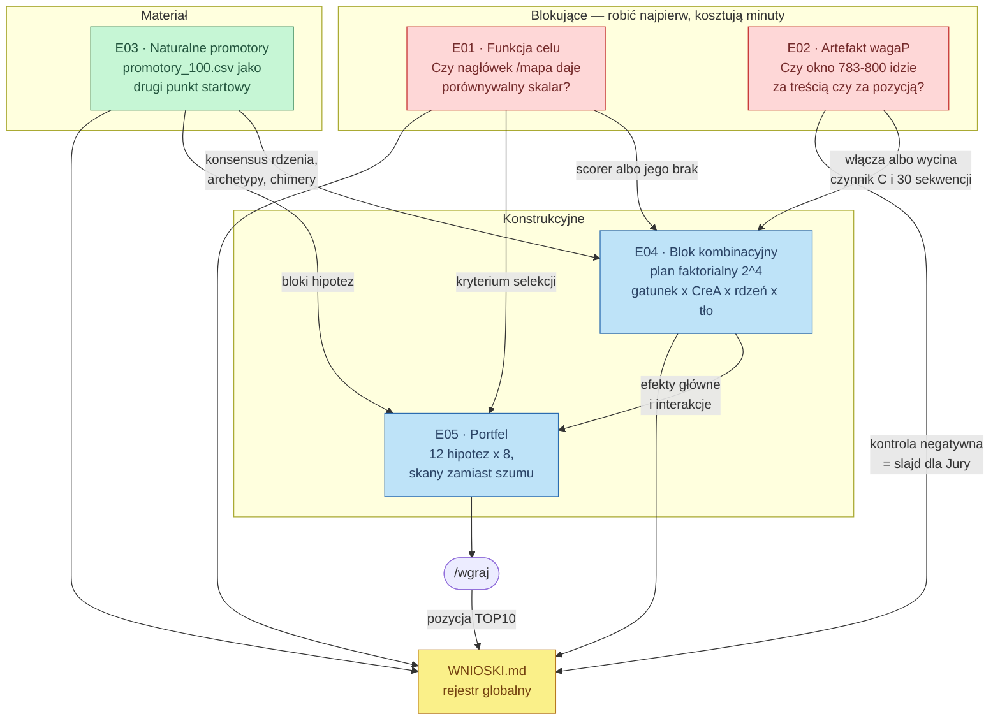
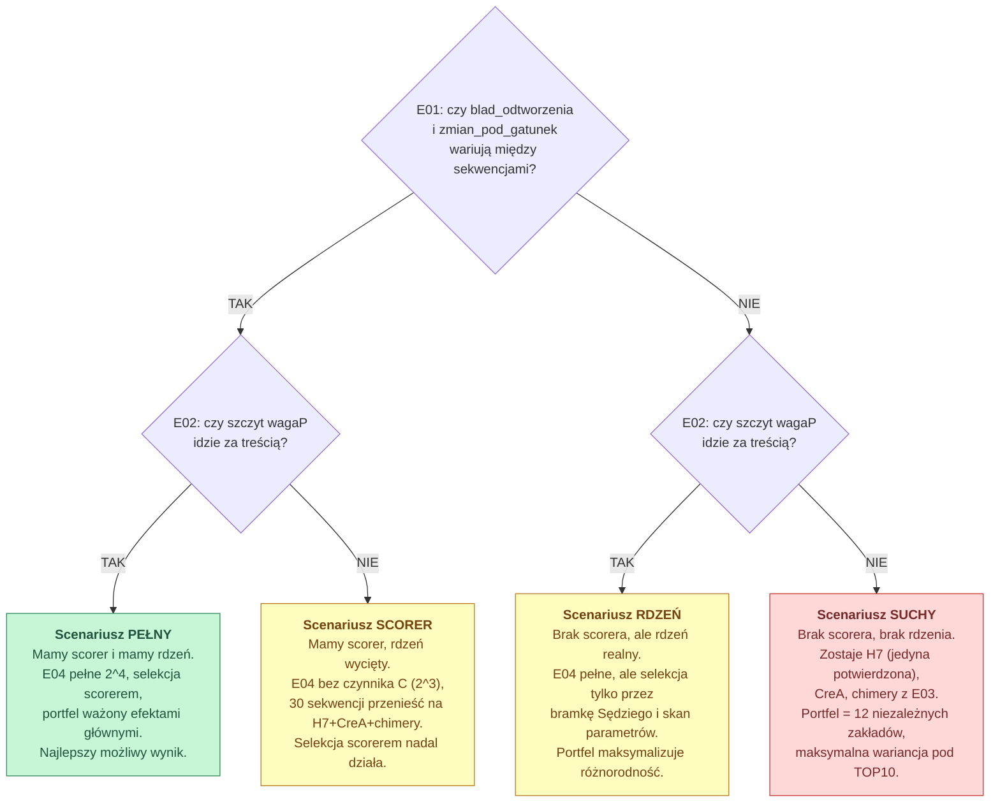

# eksperymenty/

Katalog eksperymentów drugiej fazy. Pierwsza faza (`hipotezy.ipynb`) odpowiedziała
na pytanie **czego te modele nie umieją**. Ta faza odpowiada na pytanie
**czego da się użyć zamiast tego**.

Każdy eksperyment jest samodzielny: ma `PLAN.md` (cel, protokół, kryterium
decyzyjne), `run.py` (zbiera dane z API do `wyniki.json`) i sekcję w
`eksperymenty.ipynb` (wykresy + werdykt). Wnioski spływają do jednego pliku:
[`WNIOSKI.md`](WNIOSKI.md) — to jedyny dokument, który trzeba przeczytać przed
złożeniem zgłoszenia.

---

## Dlaczego akurat te eksperymenty

Z pierwszej fazy wyszło, że **nie mamy funkcji celu**. Sędzia jest wysycony
(H4, H5, H6), Wyrocznia daje dwie liczby na 5 minut przy pięciu drużynach —
czyli około jednego bitu na zgłoszenie. Cała optymalizacja stoi na tym, czy
znajdziemy skalar, który da się liczyć lokalnie i porównywać między sekwencjami.

Jednocześnie plan zgłoszenia z komórki 36 `hipotezy.ipynb` przeznacza 30 %
budżetu na edycję okna 783–800, a **notebook sam przyznaje, że nie wiadomo, czy
to okno cokolwiek znaczy** (możliwy artefakt brzegowy konwolucji).

Stąd dwa eksperymenty blokujące (E01, E02), jeden dostarczający materiału (E03)
i dwa konstrukcyjne (E04, E05).

---

## Mapa zależności



---

## Drzewo decyzyjne

Dwa eksperymenty blokujące mają cztery możliwe kombinacje wyników i każda
prowadzi do innego zgłoszenia. Warto to mieć przed oczami, zanim ruszą wywołania:



**Ważne:** żaden ze scenariuszy nie jest katastrofą. Nawet SUCHY jest lepszy od
obecnego zgłoszenia, bo obecne zgłoszenie to jedna rodzina powtórzona sto razy,
a SUCHY to dwanaście niezależnych zakładów. Statystyka pozycyjna nagradza
liczbę **niezależnych** losowań, nie liczbę sekwencji.

---

## Kolejność i budżet

| # | eksperyment | wywołań API | czas | blokuje |
|---|---|---|---|---|
| E01 | funkcja celu | ~60 | 2 min | E04, E05 |
| E02 | artefakt wagaP | ~30 | 1 min | E04, E05 |
| E03 | naturalne promotory | ~300 | 5 min | E04, E05 |
| E04 | blok kombinacyjny | ~200 | 10 min | E05 |
| E05 | portfel + zgłoszenie | ~150 | 15 min | — |

Limity to 600/min dla Sędziego i Nawigatora — **nic tu nie jest wąskim gardłem**.
Wąskim gardłem jest okno 5 minut na `/wgraj` i to, że każde zgłoszenie niesie
około jednego bitu informacji zwrotnej.

```bash
cd eksperymenty
python E01_funkcja_celu/run.py
python E02_artefakt_wagap/run.py
python E03_naturalne_promotory/run.py     # wymaga data/promotory_100.csv
python E04_blok_kombinacyjny/run.py
python zbuduj_notebook.py                 # -> eksperymenty.ipynb
.venv/bin/jupyter lab eksperymenty/eksperymenty.ipynb
```

Każdy `run.py` zapisuje `wyniki.json` obok siebie i **nie nadpisuje go po cichu** —
przy powtórnym uruchomieniu robi kopię z sygnaturą czasową. `zbuduj_notebook.py`
pomija sekcje, dla których nie ma jeszcze `wyniki.json`, więc notebook da się
budować w trakcie.

---

## Zasady, które obowiązują w każdym eksperymencie

Wynikają wprost z pomyłek pierwszej fazy i są tu zapisane, żeby się nie powtórzyły.

1. **Kontrola negatywna albo nie ma wniosku.** H1 przeszła do planu zgłoszenia
   bez kontroli i o mało nie kosztowała 30 % budżetu. Każdy eksperyment ma
   w protokole jawnie wypisaną kontrolę.

2. **Sędzia jest bramką, nie miarą.** Wolno go pytać „czy to nadal promotor".
   Nie wolno na jego podstawie odrzucać wariantu, który zmienia wymiar
   niewidoczny dla niego: gatunek, kontekst genu, usunięcie represora.

3. **Rozdzielaj pozycję od treści.** Model widzi sekwencję wyrównaną do TSS.
   Każdy sygnał zależny od pozycji trzeba skontrolować permutacją i rotacją,
   zanim się go nazwie biologią.

4. **Skorelowane warianty to jedno losowanie.** Dwadzieścia sekwencji różniących
   się szumem wokół jednej hipotezy daje jedno losowanie z ogona, nie dwadzieścia.
   Wewnątrz bloku skanujemy parametr, między blokami zmieniamy hipotezę.

5. **Etykieta niesie pochodzenie.** Format `E04_A1B0C1D0_r02` — po zgłoszeniu
   widać, z czego składał się portfel, nawet bez atrybucji per sekwencja.

6. **Uzasadnienie biologiczne przed edycją, nie po.** Połowa oceny to obrona.
   Każdy czynnik w E04 ma wpisane w `PLAN.md`, co robi w komórce i dlaczego.

---

## Co z tego idzie na prezentację

Trzy rzeczy, które nie są „wynikiem", tylko metodyką — a Jury ocenia metodykę:

- **E02 to kontrola negatywna.** Pokazanie, że sprawdziliście, czy sygnał
  z modelu nie jest artefaktem architektury, jest mocniejsze niż samo
  wykorzystanie tego sygnału. Niezależnie od tego, jak wypadnie.
- **E04 to plan faktorialny.** Efekty główne i interakcje z ośmiu–szesnastu
  komórek, a nie „zmieniliśmy kilka rzeczy naraz i wyszło lepiej".
- **E01 to szukanie miary tam, gdzie organizatorzy jej nie dali.** Jeśli
  nagłówek `/mapa` faktycznie niesie porównywalny skalar, to jest najciekawszy
  pojedynczy wynik całego projektu — bo znaczy, że dostępne API miało funkcję
  celu, tylko nieopisaną.

I jedna rzecz negatywna, którą też warto pokazać: **sekwencje „silnych
promotorów" pobrane z modelu językowego okazały się tandemowym powtórzeniem
`AGCTAGCTAGCTAGG` o okresie 48 pz i entropii 4-merów 2,89 bita zamiast ~8**.
Slajd o tym, jak odrzuciliście zatrute dane wejściowe, jest wart więcej niż
slajd o tym, jak ich użyliście.
